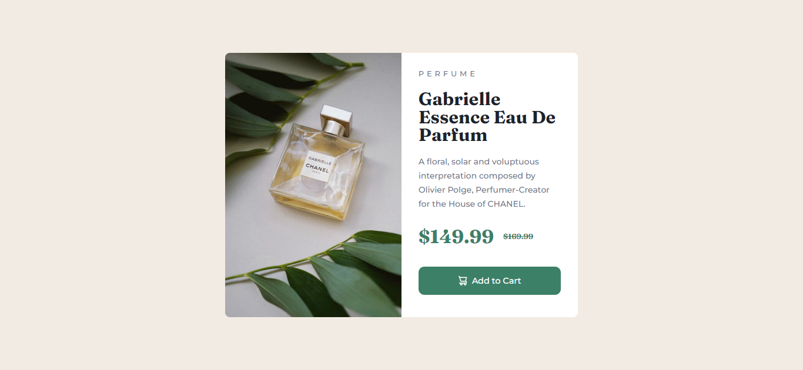

<!-- @format -->

# Frontend Mentor - Product preview card component solution

This is a solution to the [Product preview card component challenge on Frontend Mentor](https://www.frontendmentor.io/challenges/product-preview-card-component-GO7UmttRfa). Frontend Mentor challenges help you improve your coding skills by building realistic projects.

## Table of contents

- [Overview](#overview)
  - [The challenge](#the-challenge)
  - [Screenshot](#screenshot)
  - [Links](#links)
- [My process](#my-process)
  - [Built with](#built-with)
  - [What I learned](#what-i-learned)
  - [Continued development](#continued-development)
  - [Useful resources](#useful-resources)
- [Author](#author)
- [Acknowledgments](#acknowledgments)

**Note: Delete this note and update the table of contents based on what sections you keep.**

## Overview

### The challenge

Users should be able to:

- View the optimal layout depending on their device's screen size
- See hover and focus states for interactive elements

### Screenshot



### Links

- Solution URL: [Add solution URL here](https://your-solution-url.com)
- Live Site URL: [Add live site URL here](https://your-live-site-url.com)

## My process

- Started with Mobile design first after initially attempting to style desktop version first...
- This proved to be far easier to solve for responsive layout and change image automatically.

### Built with

- Semantic HTML5 markup
- CSS custom properties
- Flexbox
- CSS Grid
- Mobile-first workflow

### What I learned

Important lesson learned here was the use of 'srcset' - with a media query to swap image source & learned that a 'mobile first' approach is easier to style with this kind of layout.

Alos: learned the use of 'grid-template-columns' - Struggled initially to resolve layout changing from mobile to desktop until I used 'grid' for the parent container, and used 'grid-template-columns' in media query.

** (See acknowledgements for a tip of the hat) **

```html - code snippet that solved the image swapping
<picture class="pr-card__img">
  <source
    srcset="./images/image-product-desktop.jpg"
    media="(min-width: 600px)"
  />
  
</picture>
```

```css - snippet that solved my layout issues.
@media (min-width: 600px) {
  article {
    grid-template-columns: 1fr 1fr;
  }
}
```

## Author

- Website - [James Dennis](https://jamesdennis.org)
- Frontend Mentor - [@emarketguy27](https://www.frontendmentor.io/profile/emarketguy27)

## Acknowledgments

Big tip of the hat to Kevin Powell : https://www.kevinpowell.co/

I had the design layout completed and perfect for desktop, but could not get the design to work properly on mobile...
Kevin's Youtube solution provided the answer - as I have detailed above.
Thank Kevin - an inspiration.
